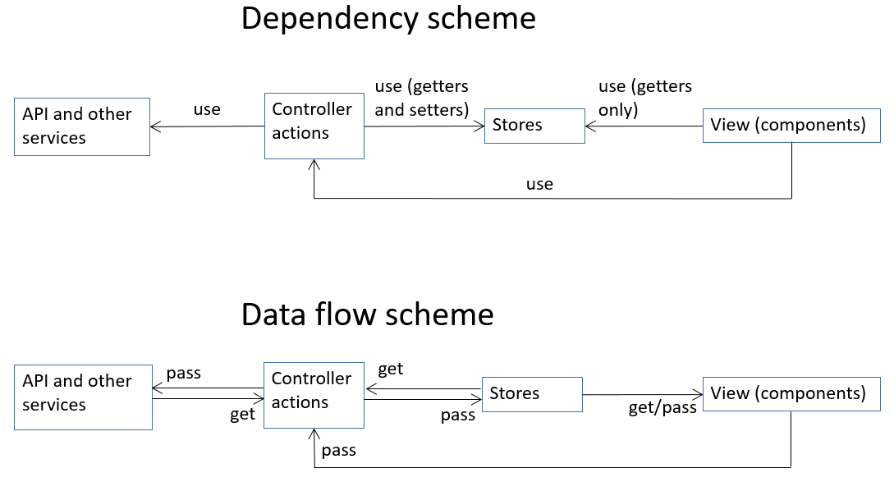

## Example of architecture, where stores works only with shared data, without side effects. Side effects moved to the controller and services. 
 [Habr post](https://habr.com/ru/post/546628/)
 
 [Codesanbox]( https://codesandbox.io/s/mobx-react-4-layer-architecture-cko6u)

 
 To reduce the boilerplate (that do not create new types of stores, controllers, api for every page/feature):   
 [wrapFeature function example](https://github.com/sergeysibara/mobx-react-4-layer-architecture/blob/wrap-feature/src/core/wrapFeature.ts)   
 [using example](https://github.com/sergeysibara/mobx-react-4-layer-architecture/blob/wrap-feature/src/contexts.ts#L43)   
      
Schemes:

___

This project was bootstrapped with [Create React App](https://github.com/facebook/create-react-app).

## Available Scripts in the project directory
#### Standard Create React App scripts:  
`yarn start`  
`yarn build`  
`yarn eject`  
`yarn test`  
`yarn lint`  
